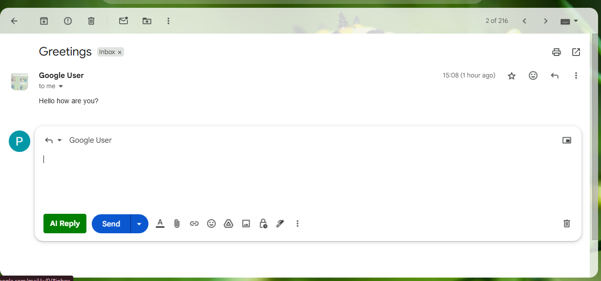
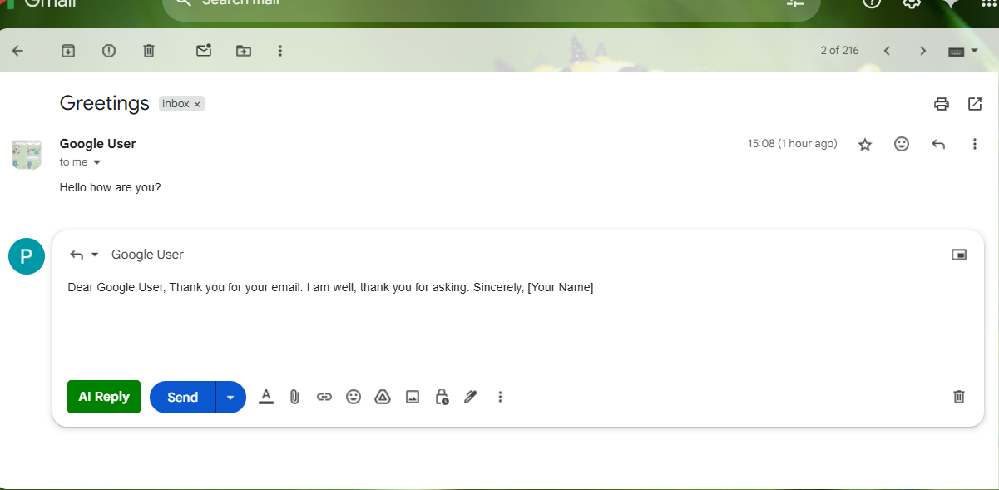
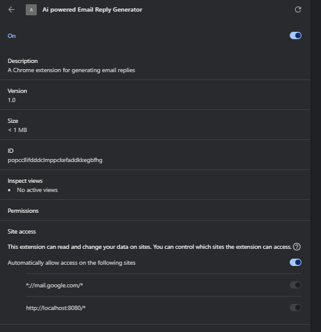

# MailGenie - AI Powered Email Reply Generator

This project is a Chrome extension that uses AI to generate smart email replies directly inside Gmail. It consists of a **frontend Chrome extension** (`email-writer-extension`) and a **Spring Boot backend** (`email-write-backend`) that connects to an AI model (such as Gemini or GPT).

---

## Features

- 📨 **One-click AI Reply**: Adds an "AI Reply" button to Gmail's compose window.
- 🤖 **Smart Suggestions**: Generates context-aware replies using AI.
- 🎨 **Seamless Integration**: Button appears next to Gmail's Send button.
- ⚡ **Fast & Secure**: Backend runs locally, no data sent to third-party servers.
- 🛠️ **Customizable**: Easily change AI model, tone, or backend logic.

---

## Folder Structure

```
email-writer-react/
│
├── email-writer-extension/   # Chrome extension (frontend)
│   ├── content.js
│   ├── content.css
│   ├── manifest.json
│   ├── popup.html
│   └── icons/
│
└── email-write-backend/      # Spring Boot backend (AI API)
    ├── src/
    ├── pom.xml
    └── ...
```

---

## How It Works

1. **Chrome Extension** injects an "AI Reply" button into Gmail's compose toolbar.
2. When clicked, it grabs the email content and sends it to the backend API.
3. **Spring Boot Backend** receives the request, calls the AI model (e.g., Gemini), and returns a suggested reply.
4. The extension inserts the reply into the Gmail compose box.

---

## Setup Instructions

### 1. Backend (Spring Boot)

#### Prerequisites

- Java 17+
- Maven

#### Steps

```sh
cd email-write-backend
# Configure your API keys in src/main/resources/application.properties
mvn clean install
mvn spring-boot:run
```

- The backend will start on [http://localhost:8080](http://localhost:8080).
- Make sure to set your AI API key and endpoint in `application.properties`:
  ```
  gemini-api-url=https://generativelanguage.googleapis.com/v1beta/models/gemini-pro:generateContent
  gemini-api-key=YOUR_API_KEY
  ```

### 2. Chrome Extension

#### Steps

1. Go to `chrome://extensions/` in Chrome.
2. Enable "Developer mode".
3. Click "Load unpacked" and select the `email-writer-extension` folder.
4. The extension icon should appear in your browser.

---

## Usage

1. Open [Gmail](https://mail.google.com).
2. Click "Compose" or open a reply window.
3. You will see an **AI Reply** button next to the Send button.
4. Click it to generate a smart reply for the current email.

---

## Customization

- **Change AI Model or Tone**: Edit the backend prompt logic in [`EmailGneratorService.java`](email-write-backend/src/main/java/com/email/writer/service/EmailGneratorService.java).
- **Change Button Style**: Edit [`content.js`](email-writer-extension/content.js) or add styles in [`content.css`](email-writer-extension/content.css).
- **API Endpoint**: Update the fetch URL in [`content.js`](email-writer-extension/content.js) if your backend runs elsewhere.

---

## Security & Privacy

- All email content is processed locally or on your own backend.
- No data is sent to third-party servers except the AI API you configure.

---

## Troubleshooting

- **Button not appearing?**
  - Make sure the backend is running.
  - Refresh Gmail after (re)loading the extension.
- **API errors?**
  - Check backend logs for errors.
  - Ensure your API key and endpoint are correct.
- **Button not disabled during generation?**
  - Ensure you are using a `<button>` element, not a `<div>`.

---

## Contributing

Pull requests and issues are welcome!  
Please open an issue for bugs or feature requests.

---

## License

This project is licensed under the MIT License.

---

## Credits

- [Google Gemini API](https://aistudio.google.com/app/apikey)
- [Spring Boot](https://spring.io/projects/spring-boot)
- [Chrome Extensions API](https://developer.chrome.com/docs/extensions/)

---

**Happy Emailing!**
Feel free to reach out if you have any questions or suggestions.


Here are few Screenshots of the extension in action:




How to run the extension:
____________________________________________________
1)Clone the repository.
API key in `application.properties` file.
API url in `application.properties`
2)Run the backend using `mvn spring-boot:run`.
3)Load the extension in Chrome by going to `chrome://extensions/` and clicking "Load unpacked" and selecting the `email-writer-extension` folder.
4)Open Gmail, compose a new email or reply to an existing one, and click the "AI Reply" button to generate a smart reply.

I have used gemini flash 2.5 you can use any other AI model by changing the API URL and request format in the backend service

A frontend React app is not required for this extension as it directly injects the button into Gmail's compose window using content scripts. The backend handles the AI generation logic.
However, I have added one for just testing purposes, you can run it using `npm start` in the `email-writer-frontend` folder.